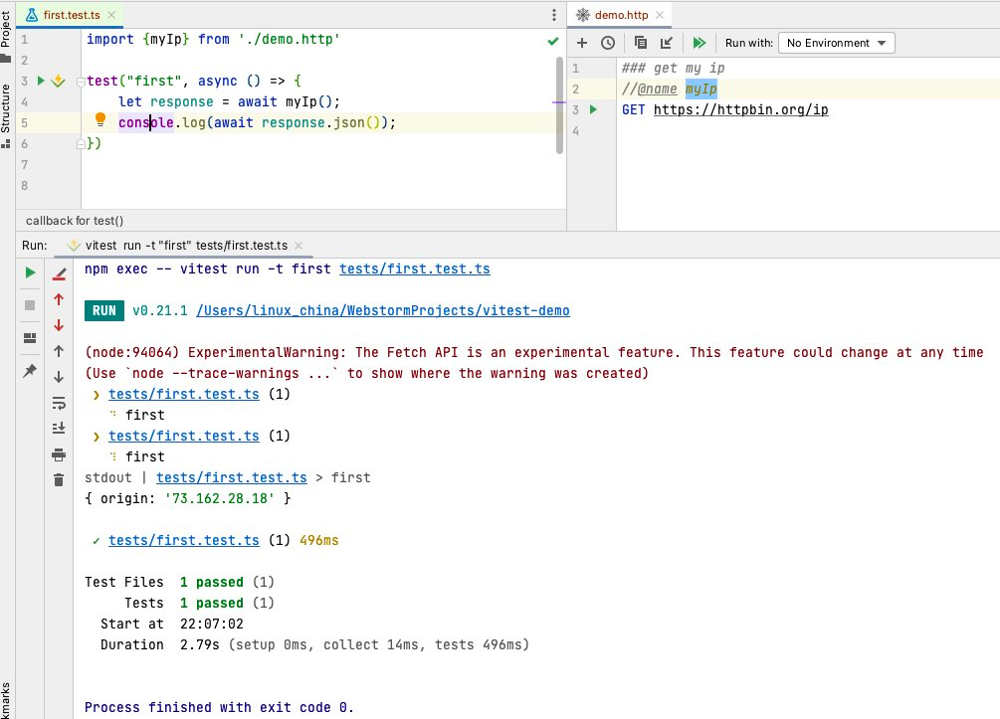

Vite httpfile plugin
=======================

An Vite.js plugin to import [httpfile](https://www.jetbrains.com/help/idea/http-client-in-product-code-editor.html) for HTTP Request/GraphQL request.



# How to use?

* Create a http file, such as `demo.http`, code as following:

```
### get my ip
//@name myIp
GET https://httpbin.org/ip
User-Agent: curl/7.47.0

### post test
//@name postTest
POST https://{{host}}/post
User-Agent: curl/7.47.0
Content-Type: application/json

{
  "name": "{{nick}}",
  "age": 42,
  "uuid": "{{$uuid}}"
}
```

* Add `vite-plugin-httpfile` to your project's `package.json` or `npm add -D vite-plugin-httpfile`.

```
 "devDependencies": {
    "vite-plugin-httpfile": "^0.1.1"
  }
```

* In JavaScript/TypeScript file, such as `hello.mjs`, and you can import http file directly. Code as following:

```javascript
import {myip} from "./demo.http";

let response = await myip();
console.log(await response.json());
```

# vite.config.ts configuration

```typescript
import {defineConfig} from 'vitest/config';

import viteHttpfilePlugin from "vite-plugin-httpfile";

export default defineConfig({
    plugins: [viteHttpfilePlugin(true)]
});
```

# Mock Support

You can mock request by adding `//@mock ` tag for request. Code as following:

```
### get my ip
//@name myIp
//@mock {"origin":"127.0.0.1"}
GET https://httpbin.org/ip
```

For multi lines data, please add more `//@mock ` lines.

```
### get csv data
//@name myData
//@mock name,gender
//@mock linux_china,M
GET https://your_service/data
Accept: text/csv
```

**Note**: if `process.env.NODE_ENV` is `production`, then mock data will not be used.

# Vitest integration

`vite.config.ts` configuration file as following:

```typescript
import {defineConfig} from 'vitest/config';

import viteHttpfilePlugin from "vite-plugin-httpfile";

export default defineConfig({
    define: {
        'import.meta.vitest': 'undefined',
    },
    test: {
        includeSource: ['src/**/*.{js,ts}', 'tests/**/*.{js,ts}'],
    },
    plugins: [viteHttpfilePlugin(true)]
});
```

Then create `tests/first.test.ts` file with following code:

```typescript
import {test} from "vitest";
import {myIp} from './demo.http';

test("my-ip", async () => {
    let response = await myIp();
    console.log(await response.json());
})
```

Finally, run `vitest` command to run your tests.

# References

* Rollup Plugin Overview: https://rollupjs.org/guide/en/#plugins-overview
* esbuild-plugin-httpfile: esbuild plugin for httpfile https://github.com/servicex-sh/esbuild-plugin-httpfile
* rollup-plugin-httpfile: rollup plugin for httpfile https://github.com/servicex-sh/rollup-plugin-httpfile
